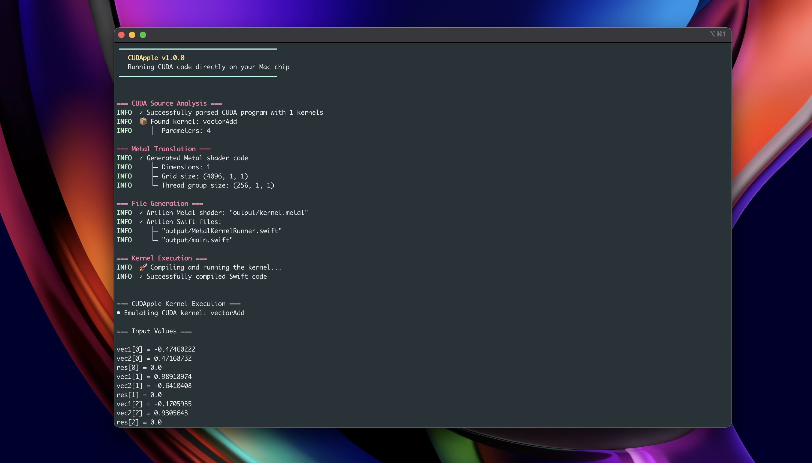

# CUDApple: A CUDA to Metal Translator

Welcome to CUDApple, a compiler project designed to automatically translate CUDA kernels into Metal shaders, enabling high-performance computation on Apple Silicon devices. This project demonstrates the feasibility of running complex CUDA-based machine learning workloads on Mac hardware through source-to-source compilation.

## Core Achievements

This project has successfully implemented the translation of a wide range of computational kernels, providing the fundamental building blocks for modern machine learning models. The examples in `src/examples` showcase a complete, end-to-end training step for a neural network.

### What's Working

- **Neural Network Layers**: Both forward and backward passes for essential layers have been translated and verified:
  - **Linear (Fully Connected)**: `linear.cu`, `linear_backward.cu`, `linear_backward_weights.cu`, `linear_backward_bias.cu`
  - **2D Convolution**: `conv2d.cu`, `conv2d_backward_weights.cu`, `conv2d_backward_bias.cu`
  - **2D Max Pooling**: `maxpool2d.cu`
- **Activation Functions**:
  - **ReLU**: `simple_relu.cu`
  - **Softmax**: `softmax.cu`, `softmax_backward.cu`
  - **Tanh** (and others): `activation_functions.cu`
- **Loss Functions & Optimizers**:
  - **Cross-Entropy Loss**: `cross_entropy_loss.cu`
  - **Stochastic Gradient Descent (SGD)**: `sgd_optimizer.cu`
- **End-to-End Training**:
  - A complete, fused kernel for a training step of a Multi-Layer Perceptron (MLP) on the MNIST dataset is working (`training_loop.cu`). This includes the forward pass, backpropagation, and weight updates in a single, efficient kernel.

## Key Learnings & Challenges

Developing a source-to-source translator for two distinct GPU programming models has offered several insights:

- **Parallelism Model Mapping**: A core challenge is mapping CUDA's execution model (grids, blocks, threads) to Metal's model (grids, threadgroups, threads). The project successfully maps concepts like `blockIdx` and `threadIdx` to their Metal equivalents, which is fundamental for correctness.
- **Fused vs. Individual Kernels**: The examples demonstrate both small, individual kernels (e.g., `vector_add.cu`) and large, "fused" kernels (`training_loop.cu`). Translating fused kernels, which minimize memory transfers by keeping intermediate data in registers, presents a unique challenge and a significant opportunity for performance optimization.
- **Atomic Operations**: Correctly translating CUDA's `atomicAdd` to its Metal counterpart is critical for algorithms like gradient accumulation, where multiple threads update the same memory location. This was a key focus to ensure numerical correctness.
- **Compiler Architecture**: Building this translator required a robust pipeline, including a parser to generate an Abstract Syntax Tree (AST) from CUDA source and a generator to convert the AST into Metal Shading Language (MSL).

## How It Works

The translation process follows a standard compiler pipeline:

1.  **Parsing**: CUDA source code (`.cu`) is parsed into an Abstract Syntax Tree (AST) that represents its structure and semantics. The AST definition can be found in `parser/unified_ast.rs`.
2.  **Code Generation**: The AST is traversed, and corresponding Metal Shading Language (MSL) code is generated. This involves mapping data types, functions, and kernel launch syntax. The generator logic is located in `metal/mod.rs` and `metal/host.rs`.

## Getting Started

To try out the project, clone the repository and follow these steps:

1.  **Compile the Project**: Use `cargo build` to compile the Rust code.
2.  **Run a Kernel**: Use `cd src` and `cargo run -- -i examples/vector_add.cu -d output/ --run -v` to translate and execute a CUDA kernel.

---

Thank you for checking out CUDApple! Don't hesitate to reach out on [X](https://twitter.com/erudictus) if you have any questions or suggestions :)